# SwiftUI_Demos

Swift UI 实现的小控件 (持续更新中)

| Demo                                                              |  效果图                                                                                                | 功能的介绍 |
| ----------------------------------------------------------------  |  ---------------------------------------------------------------------------------------------------  | -------- |  
| [HoldDownView                ](Demos/HoldDownView)                |  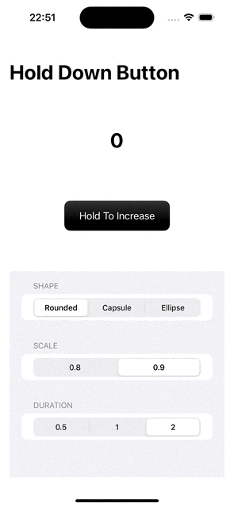                                | 按压手势按钮 |  
| [HorizontalWheelPicker       ](Demos/HorizontalWheelPicker)       |  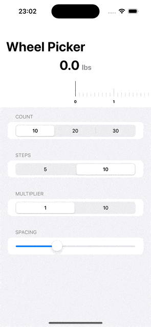              | 滑动卡尺 |  
| [FlipClockAnimation          ](Demos/FlipClockAnimation)          |  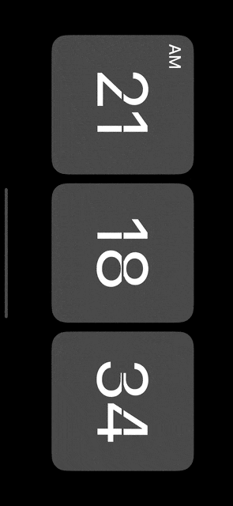                    | 时钟卡片翻页动画 |  
| [MasonryLayout               ](Demos/MasonryLayout)               |                                | 图片瀑布流 |  
| [HelloAnimation              ](Demos/HelloAnimation)              |  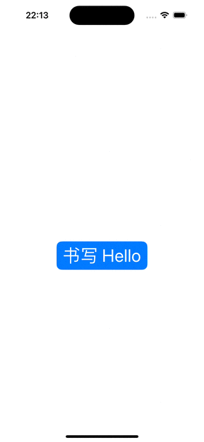                            | Hello 动画 |  
| [CharRain                    ](Demos/CharRain)                    |  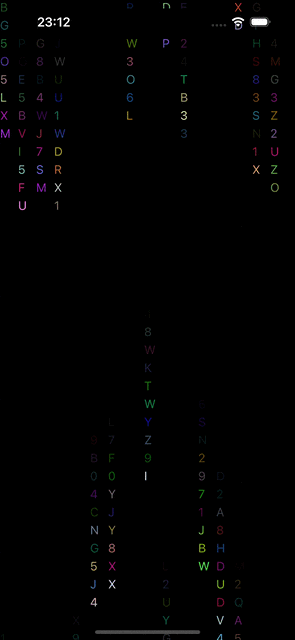                                        | 字符雨动画 |  
| [StackedCards                ](Demos/StackedCards)                |  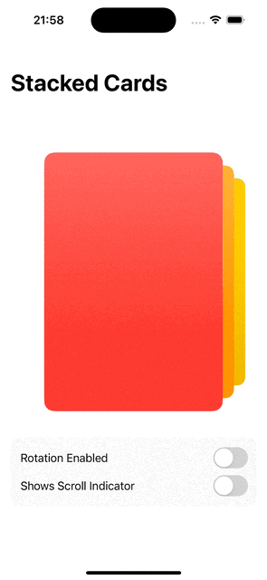                                | 卡片堆叠 |    
| [BoomerangCardsView          ](Demos/BoomerangCardsView)          |                      |  |     
| [SwipeCardView               ](Demos/SwipeCardView)               |  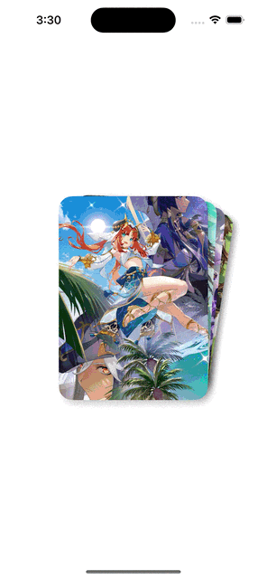                              |  |  
| [TinderCardUI                ](Demos/TinderCardUI)                |  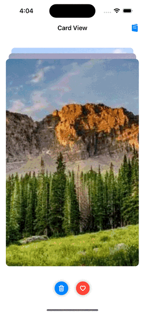                                |  |   
| [AnimatedPageIndicator       ](Demos/AnimatedPageIndicator)       |  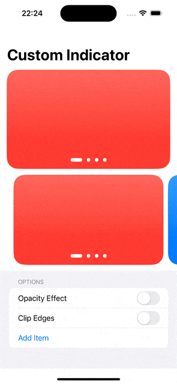              | 自定义页面指示器 | 
| [CustomSlider                ](Demos/CustomSlider)                |  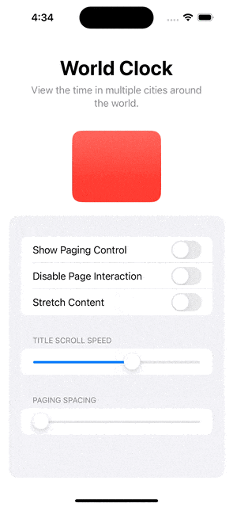                                | 自定义Slider |  
| [InfiniteCarouselView        ](Demos/InfiniteCarouselView)        |  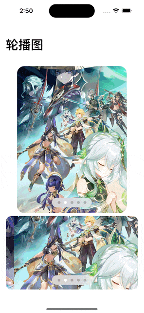                | 轮播图 |   
| [InfiniteView                ](Demos/InfiniteView)                |  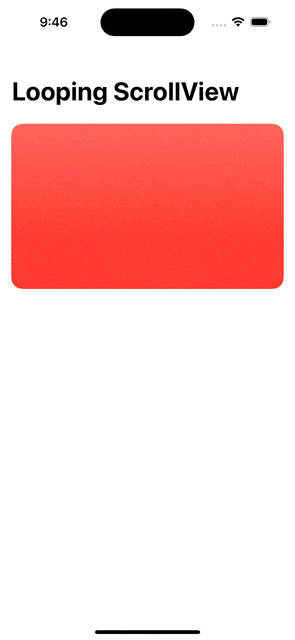                                | 无限轮播 | 
| [MaterialCarouselView        ](Demos/MaterialCarouselView      )  |                  | 转盘 |      
| [MovieBannerView             ](Demos/MovieBannerView)             |  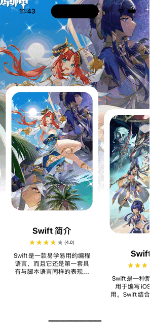                          |  |     
| [ParallaxCarousel            ](Demos/ParallaxCarousel          )  |  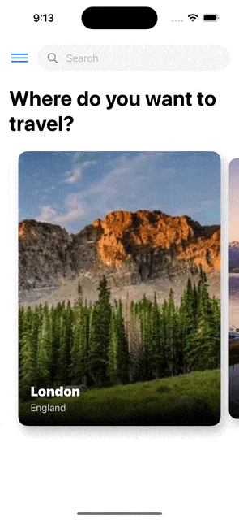                        |  |   
| [ParallaxCarouselView        ](Demos/ParallaxCarouselView)        |                  |  |    
| [Coverflow                   ](Demos/Coverflow)                   |  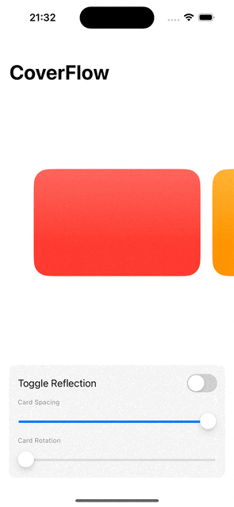                                      | 视图3D旋转效果 |     
| [Carousel3DView              ](Demos/Carousel3DView)              |                              | 3D 转盘 |    
| [AnimatedSegmentedControl    ](Demos/AnimatedSegmentedControl)    |  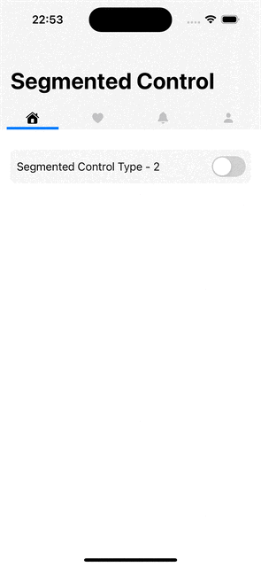        | 分段控制器切换动画 | 
| [YoutubeMiniPlayer           ](Demos/YoutubeMiniPlayer)           |  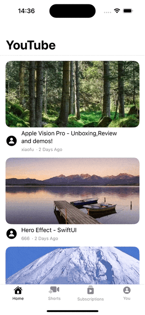                      |  | 
| [MapsBottomSheetV2           ](Demos/MapsBottomSheetV2)           |  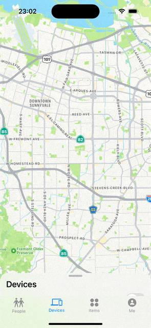                      |  | 
| [DraggableMapPin             ](Demos/DraggableMapPin)             |                            |  | 
| [PopToRoot                   ](Demos/PopToRoot)                   |  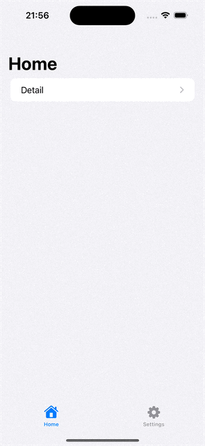                                      | pop to root | 
| [StretchySlider              ](Demos/StretchySlider)              |                              | 弹性滑块 | 
| [HeroEffect                  ](Demos/HeroEffect)                  |  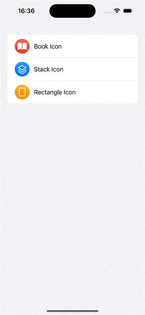                                    | 转场动画 | 
| [MinimalTodo                 ](Demos/MinimalTodo)                 |                                    | Swift Data 和 Widget 交互学习 | 
| [ShareSheetExtension         ](Demos/ShareSheetExtension)         |                    | 系统相册照片分享至APP | 
| [CustomFileExtension         ](Demos/CustomFileExtension)         |  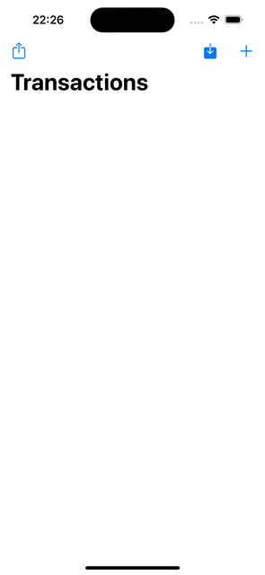                  | 数据加密存储和数据解密读取 | 
| [ScrollParallax              ](Demos/ScrollParallax)              |                              |  | 
| [ThemeChanger                ](Demos/ThemeChanger)                |                                  | 主题色更改动画 | 
| [CustomToasts                ](Demos/CustomToasts)                |  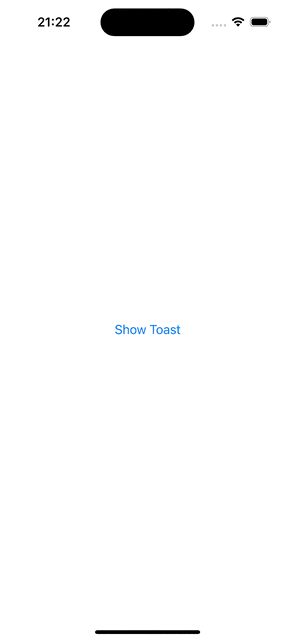                                | 提示弹框 | 
| [ImageViewer                 ](Demos/ImageViewer)                 |  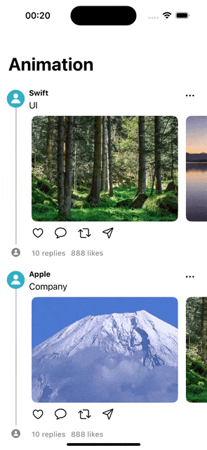                                  | 图片查看器 | 
| [WidgetsDemo                 ](Demos/WidgetsDemo)                 |  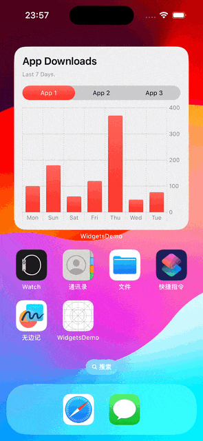                                  |  | 
| [ShineEffect                 ](Demos/ShineEffect)                 |  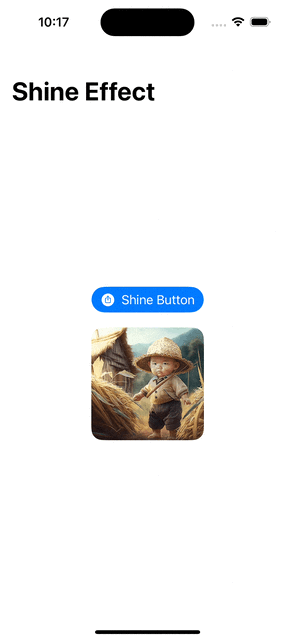                                  | 光影动效 | 
| [DropDownPicker              ](Demos/DropDownPicker)              |  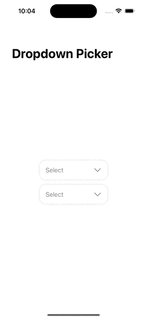                            | 选择框 | 
| [CustomSwipeActions          ](Demos/CustomSwipeActions)          |  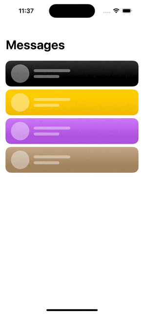                    | 滑动显示功能 |  
| [CustomScrollAnimation       ](Demos/CustomScrollAnimation)       |                | 日历滚动动画 |  
| [ReelsLayout                 ](Demos/ReelsLayout)                 |                                    | 仿短视频滑动播放与点赞 |  
| [ScrollableTabView           ](Demos/ScrollableTabView)           |  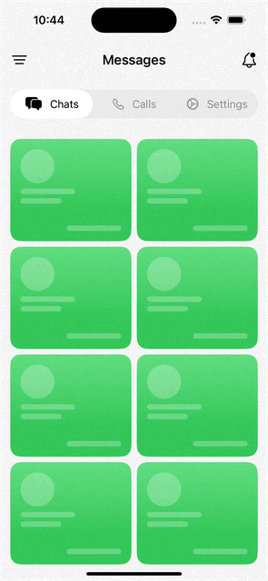                      | 标签滚动动画 |  
| [CardScroll                  ](Demos/CardScroll)                  |  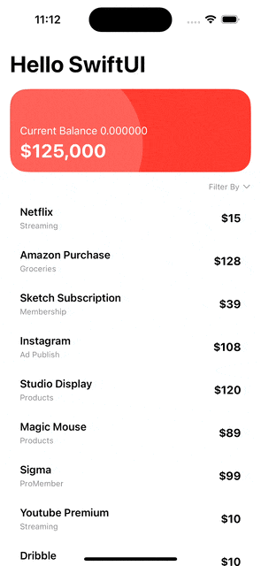                                    | 卡片表头滚动动画 |  
| [LockSwiftUIView             ](Demos/LockSwiftUIView)             |  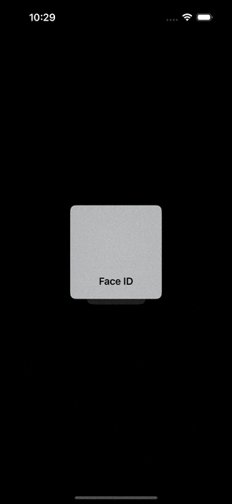                          | 面容解锁与数字解锁 |  
| [ProgressHeroEffect          ](Demos/ProgressHeroEffect)          |                      | 过度动画 | 
| [FullScreenPop               ](Demos/FullScreenPop)               |  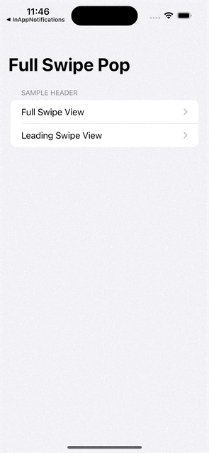                              | 任意页面控制全屏手势返回 |  
| [InAppNotifications          ](Demos/InAppNotifications)          |  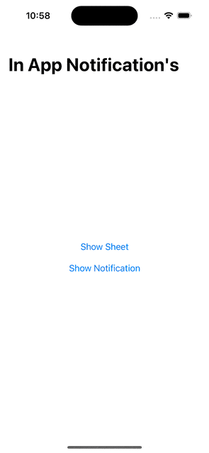                    | 为灵动岛适配的消息通知 |   
| [StatusBarUpdate             ](Demos/StatusBarUpdate)             |  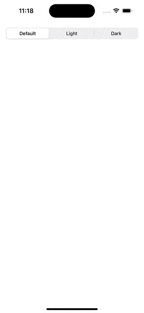                          | 自定义控制系统状态栏颜色显示 |    
| [DarkModeAnimation           ](Demos/DarkModeAnimation)           |  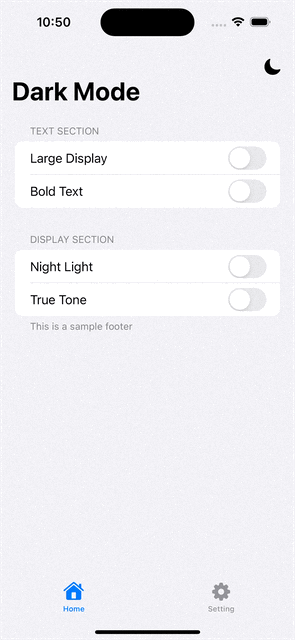                      | 暗黑模式切换动画 |    
| [HeartAnimation              ](Demos/HeartAnimation)              |                              | 心跳动画 |        
| [CustomUniversalAlert        ](Demos/CustomUniversalAlert)        |  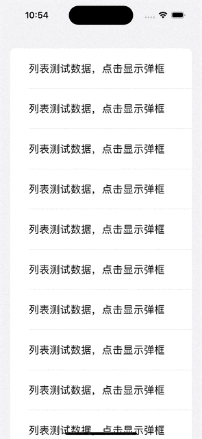                | 自定义弹框 |     
| [TagTextField                ](Demos/TagTextField              )  |                                  | 标签输入 |     
| [SwipeToHideNavBar           ](Demos/SwipeToHideNavBar         )  |                        | 列表滑动隐藏导航栏 |       
| [AnimatedSFTabBar            ](Demos/AnimatedSFTabBar          )  |  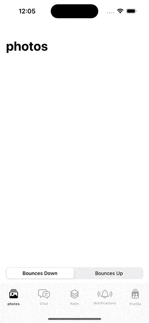                        | TabBar 动画 |     
| [DragDropDemo                ](Demos/DragDropDemo              )  |  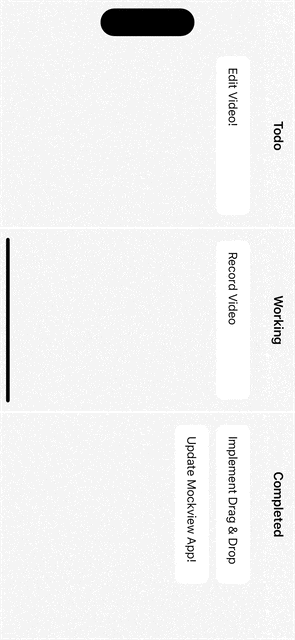                                | Drag 和 Drop |     
| [DragImagePicker             ](Demos/DragImagePicker           )  |  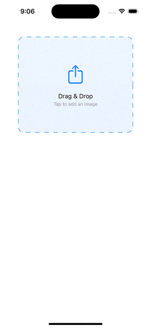                          | 动态 Sheet |     
| [DynamicSheetView            ](Demos/DynamicSheetView          )  |  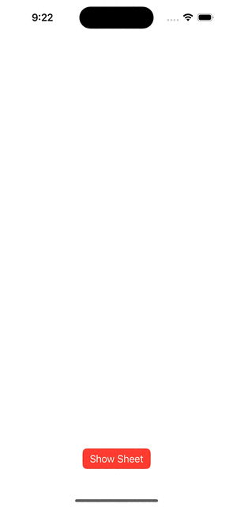                        | 玻璃面板 |     
| [GlassMorphismCardView       ](Demos/GlassMorphismCardView     )  |  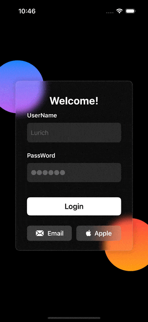              |  |      
| [RadialView                  ](Demos/RadialView                )  |                                      |  |     
| [ReOrderingGridView          ](Demos/ReOrderingGridView        )  |                      | 拖拽排序 |     
| [RepeatButton                ](Demos/RepeatButton              )  |  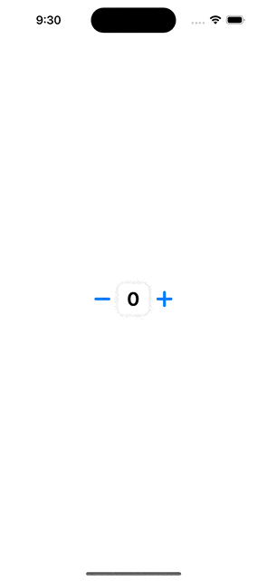                                | 数字动画 |     
| [RequestButton               ](Demos/RequestButton             )  |  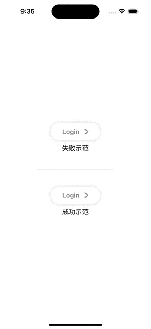                              | 请求按钮动画 |     
| [ScreenshotPreventView       ](Demos/ScreenshotPreventView     )  |                | 截屏隐私信息保护 |     
| [ShaderDemo                  ](Demos/ShaderDemo                )  |                                      | Shader 动画 |     
| [TagView                     ](Demos/TagView                   )  |  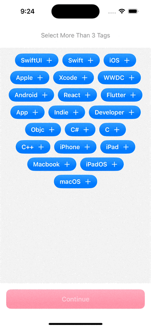                                          | 标签选择 |     
| [TransparentBlurView         ](Demos/TransparentBlurView       )  |  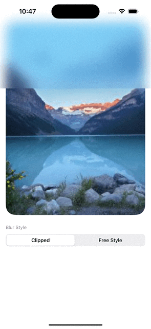                  | 渐变模糊 |     
| [TripPlannerView             ](Demos/TripPlannerView           )  |  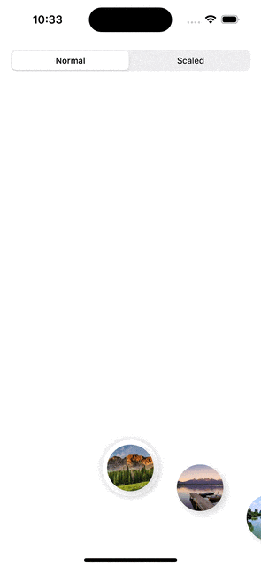                          |  |     
| [WalkthroughAnimationView    ](Demos/WalkthroughAnimationView  )  |  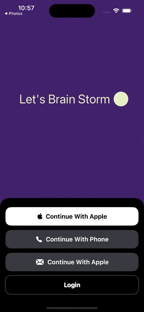        | ChatGPT 首页动画 |     
| [ShapeMorphingAnimationView  ](Demos/ShapeMorphingAnimationView)  |      |  |     
| [MatchedCarouselView         ](Demos/MatchedCarouselView)         |                    |  |     
| [SegmentControl3DView        ](Demos/SegmentControl3DView)        |                  | 3D 分段选择器 |   
| [SearchNavView               ](Demos/SearchNavView)               |                                |  |     
| [PageCurlSwipeView           ](Demos/PageCurlSwipeView)           |  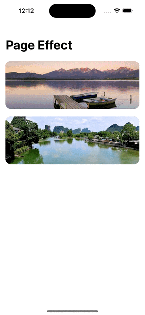                      |  |     
| [PomodoroTimerView           ](Demos/PomodoroTimerView)           |                        | 定时器 |     
| [MagnificationView           ](Demos/MagnificationView)           |  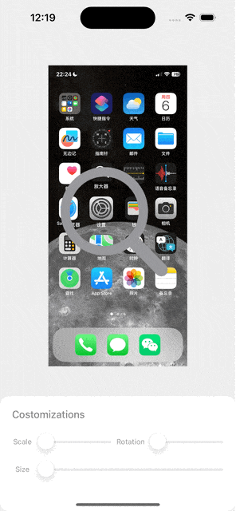                      | 放大镜 |     
| [CarouselSliderView          ](Demos/CarouselSliderView)          |                      |  |     
| [ToolBarAnimationView        ](Demos/ToolBarAnimationView)        |  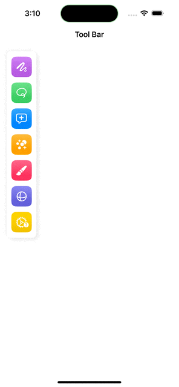                |  |     
| [ScratchCardView             ](Demos/ScratchCardView)             |  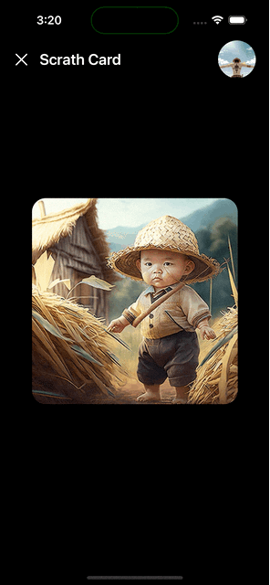                          | 刮刮卡 |     
| [ShimmerAnimationView        ](Demos/ShimmerAnimationView)        |                  | 光影动效 |     
| [RollingTextView             ](Demos/RollingTextView)             |                            | 滚动数字 |     
| [ParticleView                ](Demos/ParticleView)                |                                  | 水波纹 |     
| [ContactScrollAnimationView  ](Demos/ContactScrollAnimationView)  |      |  |     
| [ListHeaderAnimationView     ](Demos/ListHeaderAnimationView)     |            |  |     
| [OnBoardingView              ](Demos/OnBoardingView)              |                              |  |   
| [IntroView                   ](Demos/IntroView)                   |                                        |  |     
| [IndicatorAnimatedView       ](Demos/IndicatorAnimatedView)       |                |  | 
| [IsometricView               ](Demos/IsometricView)               |                                |  |     
| [SnapCarouselView            ](Demos/SnapCarouselView)            |                          |  |     
| [BallAnimationView           ](Demos/BallAnimationView)           |                        | 液体动画 |     
| [LiquidSwipeAnimationView    ](Demos/LiquidSwipeAnimationView)    |          |  |     
| [DashboardAnimationView      ](Demos/DashboardAnimationView)      |              | 进度指示器 |    
| [AppStoreDetailAnimationView ](Demos/AppStoreDetailAnimationView) |    |  |     
| [ClockView                   ](Demos/ClockView)                   |                                        | 表盘 |     
| [ParticleEmitterView         ](Demos/ParticleEmitterView)         |                    | 点赞动画 |     
| [YoutubeHomeView             ](Demos/YoutubeHomeView)             |                            |  |     
| [SpotLightView               ](Demos/SpotLightView)               |                                | 引导提示 | 
| [ShowCaseView                ](Demos/ShowCaseView)                |                                  | 引导提示2 |     
| [ResizableHeaderView         ](Demos/ResizableHeaderView)         |                    |  |     
| [TelegramDynamicIsLandHeader ](Demos/TelegramDynamicIsLandHeader) |    |  |     
| [TwitterProfileScrollingView ](Demos/TwitterProfileScrollingView) |    |  |     
| [ElasticScrollView           ](Demos/ElasticScrollView)           |                        |  |     
| [MorphingView                ](Demos/MorphingView)                |                                  | 变形动画 |  
| [PopularMovieContentView     ](Demos/PopularMovieContentView)     |            |  |     
| [GoogleWebTabView            ](Demos/GoogleWebTabView)            |                          |  |     
| [SplitView                   ](Demos/SplitView)                   |                                        |  |     
| [MapBottomSheetView          ](Demos/MapBottomSheetView)          |                      |  |     
| [WidgetView                  ](Demos/WidgetView)                  |                                      | 小组件及灵动岛 |     
| [DynamicNotificationView     ](Demos/DynamicNotificationView)     |            | 灵动岛通知适配 |     
| [RecordVideoView             ](Demos/RecordVideoView)             |                            | 录屏 |     
| [QRCodeScannerView           ](Demos/QRCodeScannerView)           |                        | 扫码 |         
| [iOSControlCenterAnimation   ](Demos/iOSControlCenterAnimation)   |        |  |     
| [DropDownView                ](Demos/DropDownView)                |                                  | 选择框 |     
| [CropImageView               ](Demos/CropImageView)               |                                | 图片裁剪 |     
| [SpotifyUI                   ](Demos/SpotifyUI)                   |                                        |  |  
| [ShopUI                      ](Demos/ShopUI)                      |                                              |  |     
| [WeatherAPPUI                ](Demos/WeatherAPPUI)                |                                  | 下雪动效 |      
| [CardCreationView            ](Demos/CardCreationView)            |                          |  |     
| [ThemeView                   ](Demos/ThemeView)                   |                                        |  |     
| [CustomKeyboardShowView      ](Demos/CustomKeyboardShowView)      |              | 自定义电话输入键盘 |     
| [CustomTabBar1               ](Demos/CustomTabBar1)               |                                | 自定义 TabBar |     
| [CustomTabBar2               ](Demos/CustomTabBar2)               |                                |  |     
| [CustomTabBar3               ](Demos/CustomTabBar3)               |                                |  |     
| [CustomTabBar4               ](Demos/CustomTabBar4)               |                                |  |     
| [CustomTabBar5               ](Demos/CustomTabBar5)               |                                |  |     
| [CustomTabBar6               ](Demos/CustomTabBar6)               |                                |  |     
| [ThreeColorAnimationView     ](Demos/ThreeColorAnimationView)     |            |  |     
| [NumberLockView              ](Demos/NumberLockView)              |                              |  |     
| [FullScreenCoverView         ](Demos/FullScreenCoverView)         |                    |  |     
| [SliderPagerView             ](Demos/SliderPagerView)             |                            |  |     
| [AutoScrollingPageView       ](Demos/AutoScrollingPageView)       |                |  |     
| [AutoScrollingTabsView       ](Demos/AutoScrollingTabsView)       |                |  |     
| [VerifyCodeView              ](Demos/VerifyCodeView)              |                              | 验证码输入 |     
| [BankCardView                ](Demos/BankCardView)                |                                  |  |     
| [PayListView                 ](Demos/PayListView)                 |                                    |  |    
| [CardGroupAnimationView      ](Demos/CardGroupAnimationView)      |              |  |     
| [DrawerSidebarMainView       ](Demos/DrawerSidebarMainView)       |                | 抽屉侧边栏 |     
| [DrawerSidebarHomeView       ](Demos/DrawerSidebarHomeView)       |                |  |     
| [LocationSearchView          ](Demos/LocationSearchView)          |                      | 地图地点搜索 |     
| [HabitTrackerView            ](Demos/HabitTrackerView)            |                          |  |     
| [TaskManager                 ](Demos/TaskManager)                 |                                    | 任务 Mini App |     
| [TaskManagerView             ](Demos/TaskManagerView)             |                            |  |     
| [SimpleTodoView              ](Demos/SimpleTodoView)              |                              |  |    
  
  
  
