# Swift UI 实现的小控件 (持续更新中)

| Demo                                                                      |  效果图                                                                                                        | 功能的介绍 |
| ------------------------------------------------------------------------  |  -----------------------------------------------------------------------------------------------------------  | -------- | 
| [CustomSplashScreen          ](SwiftUI_Demos/CustomSplashScreen)          |  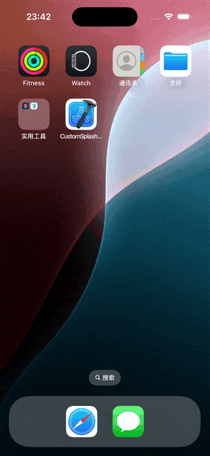                    | 启动页动画 | 
| [CustomKeyboard              ](SwiftUI_Demos/CustomKeyboard)              |  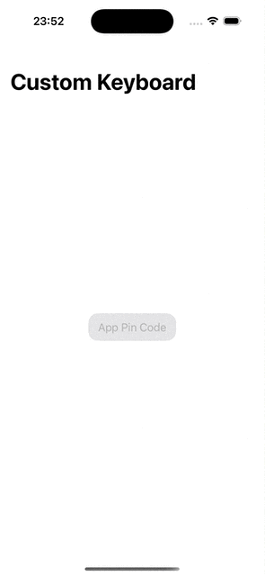                            | 自定义数字键盘 | 
| [AdaptiveLayoutDesign        ](SwiftUI_Demos/AdaptiveLayoutDesign)        |  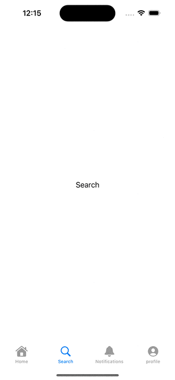                | 侧边栏适配横竖屏（iOS & iPadOS） | 
| [CustomPopView               ](SwiftUI_Demos/CustomPopView)               |  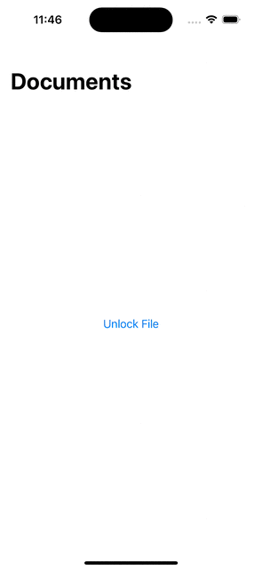                              | 自定义弹框 | 
| [CustomDragAndDrop           ](SwiftUI_Demos/CustomDragAndDrop)           |                        | 控制中心排序实现 | 
| [SwiftDataExport             ](SwiftUI_Demos/SwiftDataExport)             |                            | 数据加密存储与加密导出 | 
| [AppSchemeChanger            ](SwiftUI_Demos/AppSchemeChanger)            |  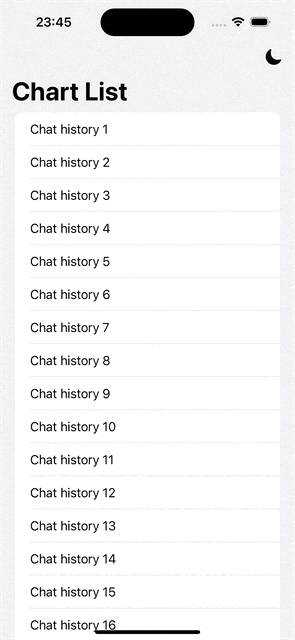                        | 主题色更换 | 
| [PSTabBar                    ](SwiftUI_Demos/PSTabBar)                    |                                          | 自定义 TabBar 8 |  
| [FloatingTabBar              ](SwiftUI_Demos/FloatingTabBar)              |  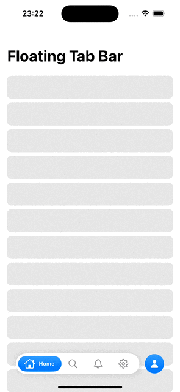                            | 自定义 TabBar 7 |    
| [CustomTabBar6               ](SwiftUI_Demos/CustomTabBar6)               |                                | 自定义 TabBar 6 |     
| [CustomTabBar5               ](SwiftUI_Demos/CustomTabBar5)               |                                | 自定义 TabBar 5 |     
| [CustomTabBar4               ](SwiftUI_Demos/CustomTabBar4)               |                                | 自定义 TabBar 4 |      
| [CustomTabBar3               ](SwiftUI_Demos/CustomTabBar3)               |  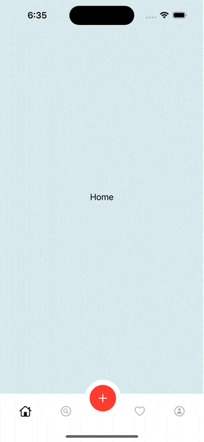                              | 自定义 TabBar 3 |     
| [CustomTabBar2               ](SwiftUI_Demos/CustomTabBar2)               |                                | 自定义 TabBar 2 |   
| [CustomTabBar1               ](SwiftUI_Demos/CustomTabBar1)               |                                | 自定义 TabBar 1 |     
| [Custom_Header               ](SwiftUI_Demos/Custom_Header)               |                                | 自定义头部视图 | 
| [CompositionalGridLayout     ](SwiftUI_Demos/CompositionalGridLayout)     |  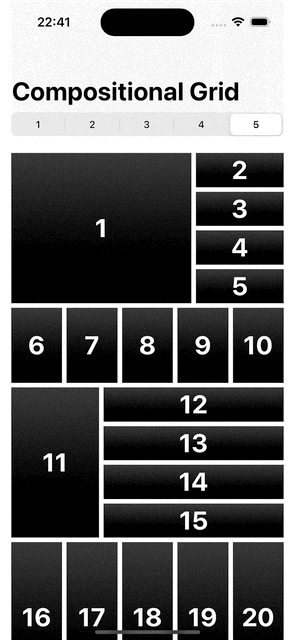          | Group API 实战示例 | 
| [FloatingBottomSheet         ](SwiftUI_Demos/FloatingBottomSheet)         |  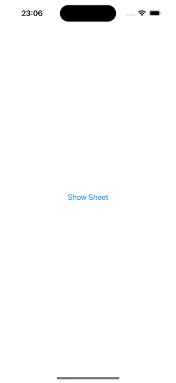                  | 浮层底部弹性框 | 
| [Walkthrough+Morphing        ](SwiftUI_Demos/Walkthrough+Morphing)        |  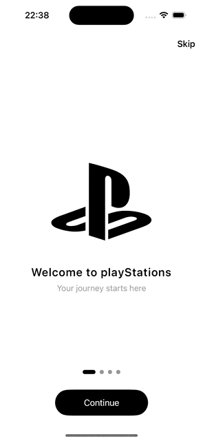                | 引导图 | 
| [CoverCarousel               ](SwiftUI_Demos/CoverCarousel)               |  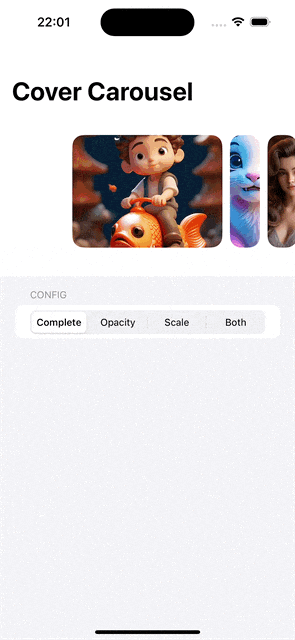                              | 轮播图 | 
| [iOS18PhotosAppUI            ](SwiftUI_Demos/iOS18PhotosAppUI)            |  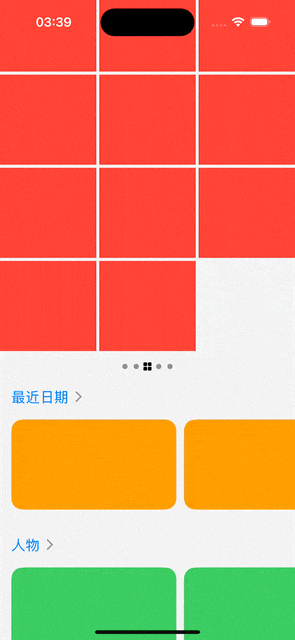                        | 仿iOS18相册UI | 
| [MetalWallpaper              ](SwiftUI_Demos/MetalWallpaper)              |                              | Metal纹理效果 | 
| [FacebookGradientMask        ](SwiftUI_Demos/FacebookGradientMask)        |  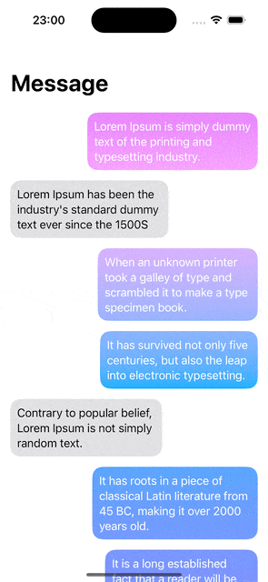                |  | 
| [CustomDropDown              ](SwiftUI_Demos/CustomDropDown)              |  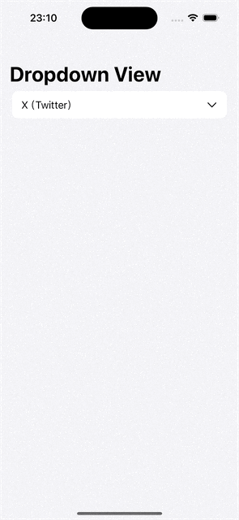                            | 自定义选择框 | 
| [AnimationLineView           ](SwiftUI_Demos/AnimationLineView)           |  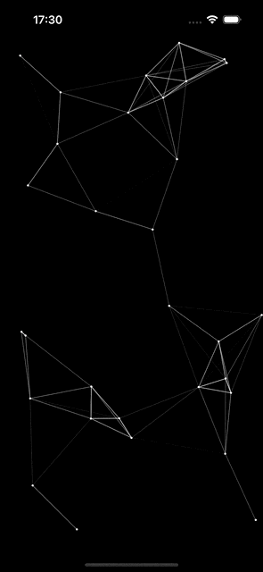                      | 魔术线2 | 
| [MagicDividingLineView       ](SwiftUI_Demos/MagicDividingLineView)       |  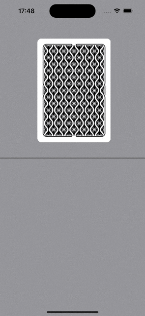              | 魔术线1 | 
| [ZoomTransitions             ](SwiftUI_Demos/ZoomTransitions)             |                            | Zoom转场示例 | 
| [Custom3DPicker              ](SwiftUI_Demos/Custom3DPicker)              |  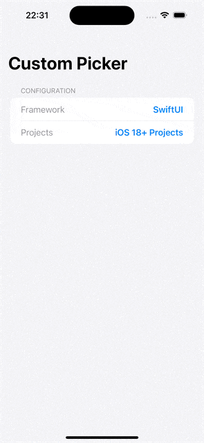                            | 3D选择器 | 
| [CustomTabView               ](SwiftUI_Demos/CustomTabView)               |  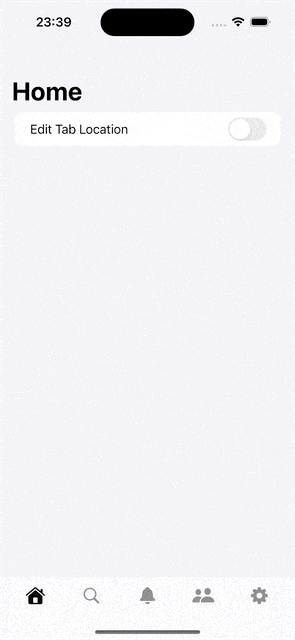                              | 可排序TabBar | 
| [PomodoroTimer               ](SwiftUI_Demos/PomodoroTimer)               |  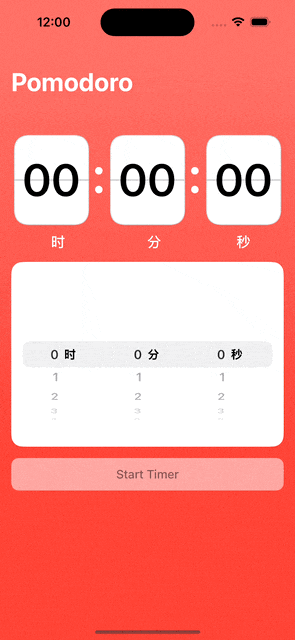                              | 计时器 | 
| [CustomTimePicker            ](SwiftUI_Demos/CustomTimePicker)            |  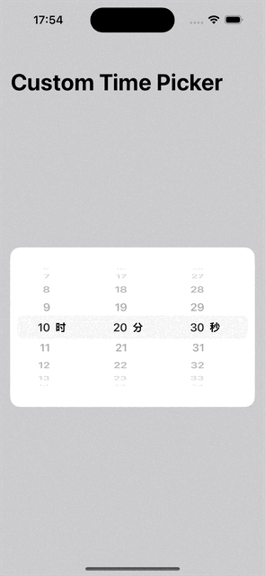                        | 自定义时间选择器 | 
| [ControlWidgetDemo           ](SwiftUI_Demos/ControlWidgetDemo)           |  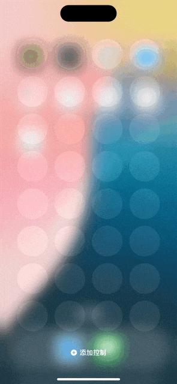                      | 自定义控制中心控件Demo | 
| [TextRendererEffect          ](SwiftUI_Demos/TextRendererEffect)          |  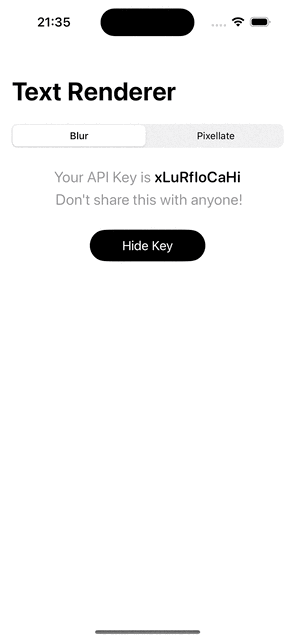                    | 黑客文字动画3 | 
| [GlitchEffect                ](SwiftUI_Demos/GlitchEffect)                |  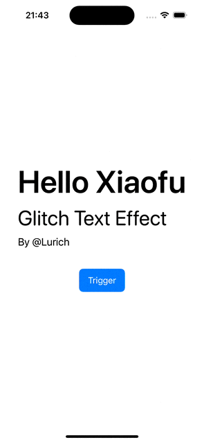                                | 黑客文字动画2 | 
| [HackerText                  ](SwiftUI_Demos/HackerText)                  |  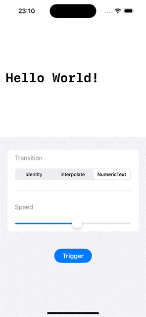                                    | 黑客文字动画1 | 
| [VerticalCarousel            ](SwiftUI_Demos/VerticalCarousel)            |  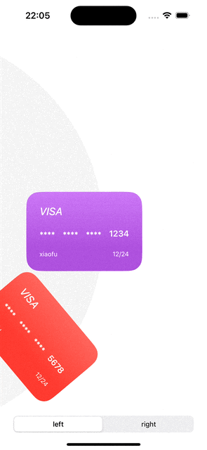                        | 旋转木马视图 | 
| [TabViewOffset               ](SwiftUI_Demos/TabViewOffset)               |  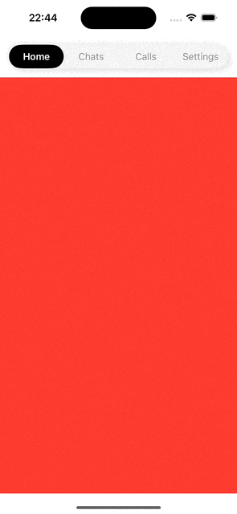                              | TabView的滑动分页效果 | 
| [StackedCardsView            ](SwiftUI_Demos/StackedCardsView)            |  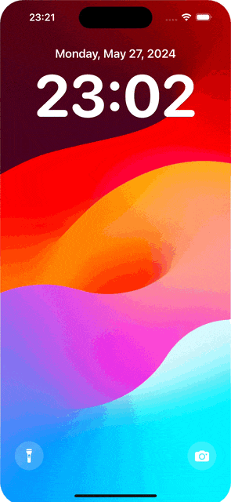                        | 仿iPhone通知页面 |
| [PhotosApp                   ](SwiftUI_Demos/PhotosApp)                   |                                        | 仿旧版系统相册 | 
| [PinterestGridAnimation      ](SwiftUI_Demos/PinterestGridAnimation)      |  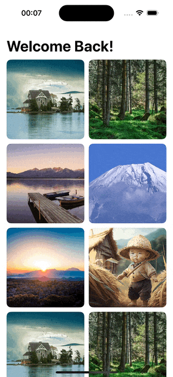            | 详情页过度动画 | 
| [ExpandableSearchBar         ](SwiftUI_Demos/ExpandableSearchBar)         |  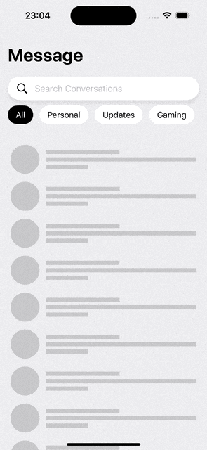                  | 搜索导航栏动画 | 
| [RangeSlider                 ](SwiftUI_Demos/RangeSlider)                 |  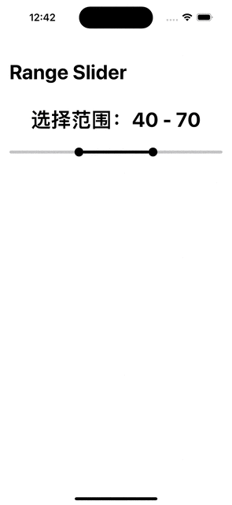                                  | 区间滑块 | 
| [ScrollableIndicators        ](SwiftUI_Demos/ScrollableIndicators)        |                  | 分栏视图切换 |  
| [FlipTransition              ](SwiftUI_Demos/FlipTransition)              |  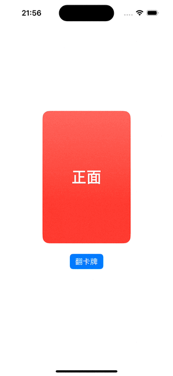                            | 翻卡动画 |  
| [NetflixUI                   ](SwiftUI_Demos/NetflixUI)                   |                                        | 启动屏动画 |  
| [BookCard                    ](SwiftUI_Demos/BookCard)                    |                                          | 翻书动画 | 
| [InteractiveFloatingButton   ](SwiftUI_Demos/InteractiveFloatingButton)   |        | 浮动按钮动画 | 
| [AnimatedCharts              ](SwiftUI_Demos/AnimatedCharts)              |                              | 图表动画 | 
| [InstagramPinchZoom          ](SwiftUI_Demos/InstagramPinchZoom)          |                      | 图片缩放查看 | 
| [LimitedTF                   ](SwiftUI_Demos/LimitedTF)                   |                                        | 自定义输入框 | 
| [AnimatedMenu                ](SwiftUI_Demos/AnimatedMenu)                |  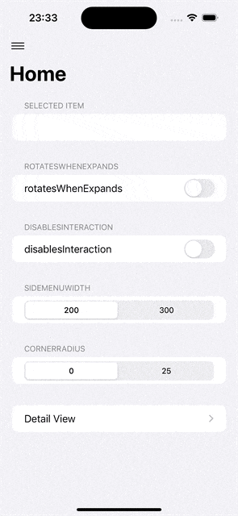                                | 侧滑菜单 | 
| [JSONWithPagination          ](SwiftUI_Demos/JSONWithPagination)          |  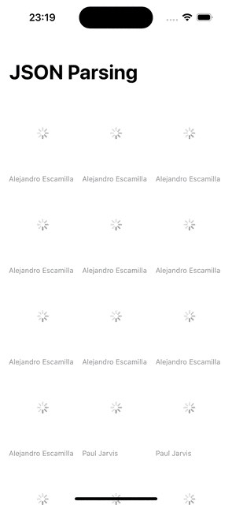                    | SDWebImageSwiftUI 的使用和上拉加载更多数据的实现 |  
| [HoldDownView                ](SwiftUI_Demos/HoldDownView)                |                                  | 按压手势按钮 |  
| [HorizontalWheelPicker       ](SwiftUI_Demos/HorizontalWheelPicker)       |                | 滑动卡尺 |  
| [FlipClockAnimation          ](SwiftUI_Demos/FlipClockAnimation)          |  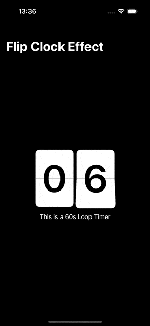                    | 时钟卡片翻页动画 |  
| [MasonryLayout               ](SwiftUI_Demos/MasonryLayout)               |  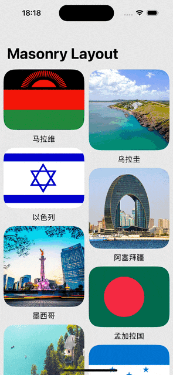                              | 图片瀑布流 |  
| [HelloAnimation              ](SwiftUI_Demos/HelloAnimation)              |                              | Hello 动画 |  
| [CharRain                    ](SwiftUI_Demos/CharRain)                    |                                          | 字符雨动画 |  
| [StackedCards                ](SwiftUI_Demos/StackedCards)                |                                  | 卡片堆叠 |    
| [BoomerangCardsView          ](SwiftUI_Demos/BoomerangCardsView)          |  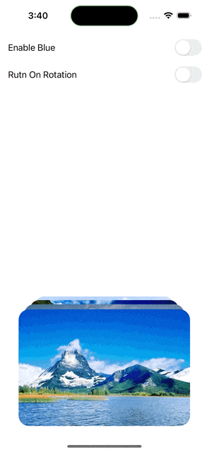                    |  |     
| [SwipeCardView               ](SwiftUI_Demos/SwipeCardView)               |                                |  |  
| [TinderCardUI                ](SwiftUI_Demos/TinderCardUI)                |  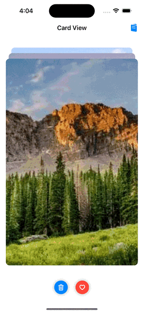                                |  |   
| [AnimatedPageIndicator       ](SwiftUI_Demos/AnimatedPageIndicator)       |                | 自定义页面指示器 | 
| [CustomSlider                ](SwiftUI_Demos/CustomSlider)                |                                  | 自定义Slider |  
| [InfiniteCarouselView        ](SwiftUI_Demos/InfiniteCarouselView)        |                  | 轮播图 |   
| [InfiniteView                ](SwiftUI_Demos/InfiniteView)                |  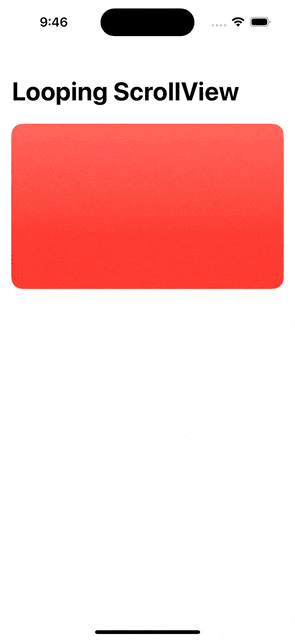                                | 无限轮播 | 
| [MaterialCarouselView        ](SwiftUI_Demos/MaterialCarouselView)        |  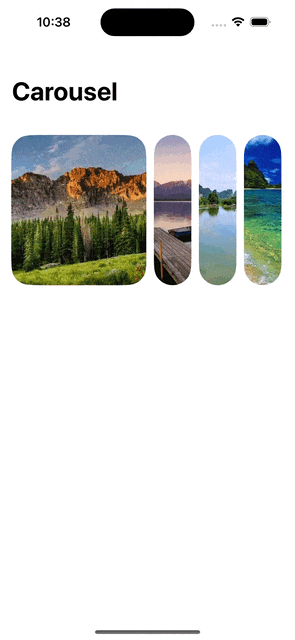                | 转盘 |      
| [MovieBannerView             ](SwiftUI_Demos/MovieBannerView)             |                            |  |     
| [ParallaxCarousel            ](SwiftUI_Demos/ParallaxCarousel)            |                          |  |   
| [ParallaxCarouselView        ](SwiftUI_Demos/ParallaxCarouselView)        |  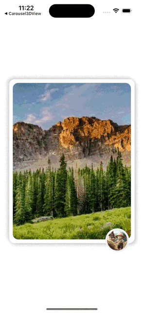                |  |    
| [Coverflow                   ](SwiftUI_Demos/Coverflow)                   |  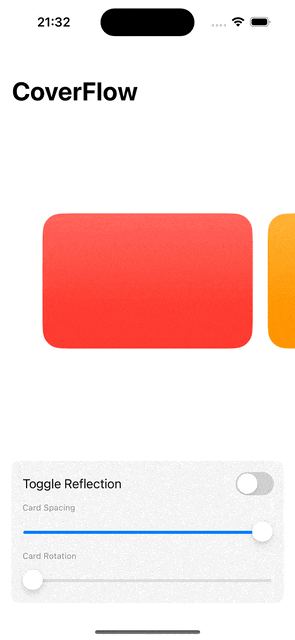                                      | 视图3D旋转效果 |     
| [Carousel3DView              ](SwiftUI_Demos/Carousel3DView)              |  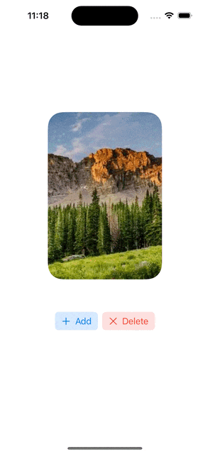                            | 3D 转盘 |    
| [AnimatedSegmentedControl    ](SwiftUI_Demos/AnimatedSegmentedControl)    |  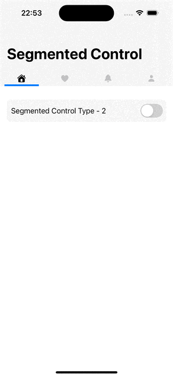        | 分段控制器切换动画 | 
| [YoutubeMiniPlayer           ](SwiftUI_Demos/YoutubeMiniPlayer)           |  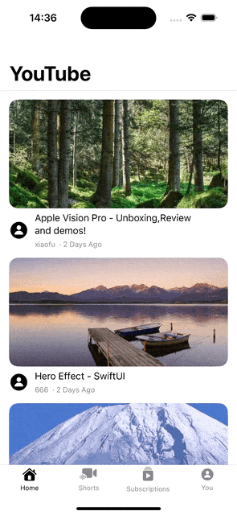                      |  | 
| [MapsBottomSheetV2           ](SwiftUI_Demos/MapsBottomSheetV2)           |                        |  | 
| [DraggableMapPin             ](SwiftUI_Demos/DraggableMapPin)             |  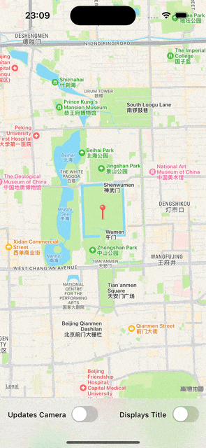                          |  | 
| [PopToRoot                   ](SwiftUI_Demos/PopToRoot)                   |                                        | pop to root | 
| [StretchySlider              ](SwiftUI_Demos/StretchySlider)              |  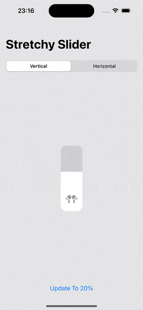                            | 弹性滑块 | 
| [HeroEffect                  ](SwiftUI_Demos/HeroEffect)                  |                                      | 转场动画 | 
| [MinimalTodo                 ](SwiftUI_Demos/MinimalTodo)                 |  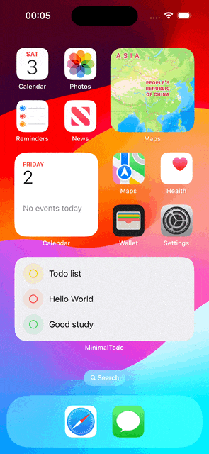                                  | Swift Data 和 Widget 交互学习 | 
| [SwiftTransformer            ](SwiftUI_Demos/SwiftTransformer)            |  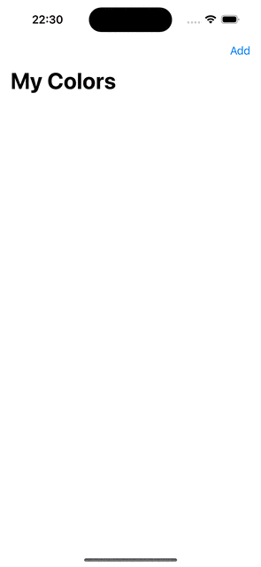                        | Swift Data 之 ValueTransformer 的学习 | 
| [ShareSheetExtension         ](SwiftUI_Demos/ShareSheetExtension)         |  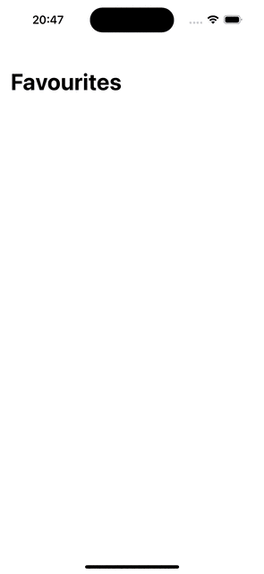                  | 系统相册照片分享至APP | 
| [CustomFileExtension         ](SwiftUI_Demos/CustomFileExtension)         |                    | 数据加密存储和数据解密读取 | 
| [ScrollParallax              ](SwiftUI_Demos/ScrollParallax)              |                              |  | 
| [ThemeChanger                ](SwiftUI_Demos/ThemeChanger)                |  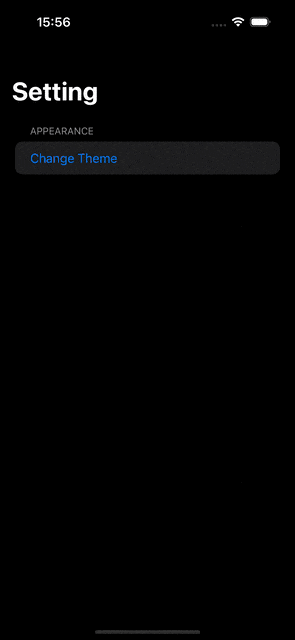                                | 主题色更改动画 | 
| [CustomToasts                ](SwiftUI_Demos/CustomToasts)                |                                  | 提示弹框 | 
| [ImageViewer                 ](SwiftUI_Demos/ImageViewer)                 |                                    | 图片查看器 | 
| [WidgetsDemo                 ](SwiftUI_Demos/WidgetsDemo)                 |                                    |  | 
| [ShineEffect                 ](SwiftUI_Demos/ShineEffect)                 |                                    | 光影动效 | 
| [DropDownPicker              ](SwiftUI_Demos/DropDownPicker)              |                              | 选择框 | 
| [CustomSwipeActions          ](SwiftUI_Demos/CustomSwipeActions)          |                      | 滑动显示功能 |  
| [CustomScrollAnimation       ](SwiftUI_Demos/CustomScrollAnimation)       |                | 日历滚动动画 |  
| [ReelsLayout                 ](SwiftUI_Demos/ReelsLayout)                 |                                    | 仿短视频滑动播放与点赞 |  
| [ScrollableTabView           ](SwiftUI_Demos/ScrollableTabView)           |                        | 标签滚动动画 |  
| [CardScroll                  ](SwiftUI_Demos/CardScroll)                  |                                      | 卡片表头滚动动画 |  
| [LockSwiftUIView             ](SwiftUI_Demos/LockSwiftUIView)             |                            | 面容解锁与数字解锁 |  
| [ProgressHeroEffect          ](SwiftUI_Demos/ProgressHeroEffect)          |                      | 过度动画 | 
| [FullScreenPop               ](SwiftUI_Demos/FullScreenPop)               |                                | 任意页面控制全屏手势返回 |  
| [InAppNotifications          ](SwiftUI_Demos/InAppNotifications)          |                      | 为灵动岛适配的消息通知 |   
| [StatusBarUpdate             ](SwiftUI_Demos/StatusBarUpdate)             |                            | 自定义控制系统状态栏颜色显示 |    
| [DarkModeAnimation           ](SwiftUI_Demos/DarkModeAnimation)           |                        | 暗黑模式切换动画 |    
| [HeartAnimation              ](SwiftUI_Demos/HeartAnimation)              |                              | 心跳动画 |        
| [CustomUniversalAlert        ](SwiftUI_Demos/CustomUniversalAlert)        |                  | 自定义弹框 |     
| [TagTextField                ](SwiftUI_Demos/TagTextField)                |                                  | 标签输入 |     
| [SwipeToHideNavBar           ](SwiftUI_Demos/SwipeToHideNavBar)           |                        | 列表滑动隐藏导航栏 |       
| [AnimatedSFTabBar            ](SwiftUI_Demos/AnimatedSFTabBar)            |                          | TabBar 动画 |     
| [DragDropDemo                ](SwiftUI_Demos/DragDropDemo)                |                                  | Drag 和 Drop |     
| [DragImagePicker             ](SwiftUI_Demos/DragImagePicker)             |                            | 动态 Sheet |     
| [DynamicSheetView            ](SwiftUI_Demos/DynamicSheetView)            |                          | 玻璃面板 |     
| [GlassMorphismCardView       ](SwiftUI_Demos/GlassMorphismCardView)       |                |  |      
| [RadialView                  ](SwiftUI_Demos/RadialView)                  |                                      |  |     
| [ReOrderingGridView          ](SwiftUI_Demos/ReOrderingGridView)          |                      | 拖拽排序 |     
| [RepeatButton                ](SwiftUI_Demos/RepeatButton)                |                                  | 数字动画 |     
| [RequestButton               ](SwiftUI_Demos/RequestButton)               |                                | 请求按钮动画 |     
| [ScreenshotPreventView       ](SwiftUI_Demos/ScreenshotPreventView)       |                | 截屏隐私信息保护 |     
| [ShaderDemo                  ](SwiftUI_Demos/ShaderDemo)                  |                                      | Shader 动画 |     
| [TagView                     ](SwiftUI_Demos/TagView)                     |                                            | 标签选择 |     
| [TransparentBlurView         ](SwiftUI_Demos/TransparentBlurView)         |                    | 渐变模糊 |     
| [TripPlannerView             ](SwiftUI_Demos/TripPlannerView)             |                            |  |     
| [WalkthroughAnimationView    ](SwiftUI_Demos/WalkthroughAnimationView)    |          | ChatGPT 首页动画 |     
| [ShapeMorphingAnimationView  ](SwiftUI_Demos/ShapeMorphingAnimationView)  |      |  |     
| [MatchedCarouselView         ](SwiftUI_Demos/MatchedCarouselView)         |                    |  |     
| [SegmentControl3DView        ](SwiftUI_Demos/SegmentControl3DView)        |                  | 3D 分段选择器 |   
| [SearchNavView               ](SwiftUI_Demos/SearchNavView)               |                                |  |     
| [PageCurlSwipeView           ](SwiftUI_Demos/PageCurlSwipeView)           |                        |  |     
| [PomodoroTimerView           ](SwiftUI_Demos/PomodoroTimerView)           |                        | 定时器 |     
| [MagnificationView           ](SwiftUI_Demos/MagnificationView)           |                        | 放大镜 |     
| [CarouselSliderView          ](SwiftUI_Demos/CarouselSliderView)          |                      |  |     
| [ToolBarAnimationView        ](SwiftUI_Demos/ToolBarAnimationView)        |                  |  |     
| [ScratchCardView             ](SwiftUI_Demos/ScratchCardView)             |                            | 刮刮卡 |     
| [ShimmerAnimationView        ](SwiftUI_Demos/ShimmerAnimationView)        |                  | 光影动效 |     
| [RollingTextView             ](SwiftUI_Demos/RollingTextView)             |                            | 滚动数字 |     
| [ParticleView                ](SwiftUI_Demos/ParticleView)                |                                  | 水波纹 |     
| [ContactScrollAnimationView  ](SwiftUI_Demos/ContactScrollAnimationView)  |      |  |     
| [ListHeaderAnimationView     ](SwiftUI_Demos/ListHeaderAnimationView)     |            |  |     
| [OnBoardingView              ](SwiftUI_Demos/OnBoardingView)              |                              |  |   
| [IntroView                   ](SwiftUI_Demos/IntroView)                   |                                        |  |     
| [IndicatorAnimatedView       ](SwiftUI_Demos/IndicatorAnimatedView)       |                |  | 
| [IsometricView               ](SwiftUI_Demos/IsometricView)               |                                |  |     
| [SnapCarouselView            ](SwiftUI_Demos/SnapCarouselView)            |                          |  |     
| [BallAnimationView           ](SwiftUI_Demos/BallAnimationView)           |                        | 液体动画 |     
| [LiquidSwipeAnimationView    ](SwiftUI_Demos/LiquidSwipeAnimationView)    |          |  |     
| [DashboardAnimationView      ](SwiftUI_Demos/DashboardAnimationView)      |              | 进度指示器 |    
| [AppStoreDetailAnimationView ](SwiftUI_Demos/AppStoreDetailAnimationView) |    |  |     
| [ClockView                   ](SwiftUI_Demos/ClockView)                   |                                        | 表盘 |     
| [ParticleEmitterView         ](SwiftUI_Demos/ParticleEmitterView)         |                    | 点赞动画 |     
| [YoutubeHomeView             ](SwiftUI_Demos/YoutubeHomeView)             |                            |  |     
| [SpotLightView               ](SwiftUI_Demos/SpotLightView)               |                                | 引导提示 | 
| [ShowCaseView                ](SwiftUI_Demos/ShowCaseView)                |                                  | 引导提示2 |     
| [ResizableHeaderView         ](SwiftUI_Demos/ResizableHeaderView)         |                    |  |     
| [TelegramDynamicIsLandHeader ](SwiftUI_Demos/TelegramDynamicIsLandHeader) |    |  |     
| [TwitterProfileScrollingView ](SwiftUI_Demos/TwitterProfileScrollingView) |    |  |     
| [ElasticScrollView           ](SwiftUI_Demos/ElasticScrollView)           |                        |  |     
| [MorphingView                ](SwiftUI_Demos/MorphingView)                |                                  | 变形动画 |  
| [PopularMovieContentView     ](SwiftUI_Demos/PopularMovieContentView)     |            |  |     
| [GoogleWebTabView            ](SwiftUI_Demos/GoogleWebTabView)            |                          |  |     
| [SplitView                   ](SwiftUI_Demos/SplitView)                   |                                        |  |     
| [MapBottomSheetView          ](SwiftUI_Demos/MapBottomSheetView)          |                      |  |     
| [WidgetView                  ](SwiftUI_Demos/WidgetView)                  |                                      | 小组件及灵动岛 |     
| [DynamicNotificationView     ](SwiftUI_Demos/DynamicNotificationView)     |            | 灵动岛通知适配 |     
| [RecordVideoView             ](SwiftUI_Demos/RecordVideoView)             |                            | 录屏 |     
| [QRCodeScannerView           ](SwiftUI_Demos/QRCodeScannerView)           |                        | 扫码 |         
| [iOSControlCenterAnimation   ](SwiftUI_Demos/iOSControlCenterAnimation)   |        |  |     
| [DropDownView                ](SwiftUI_Demos/DropDownView)                |                                  | 选择框 |     
| [CropImageView               ](SwiftUI_Demos/CropImageView)               |                                | 图片裁剪 |     
| [SpotifyUI                   ](SwiftUI_Demos/SpotifyUI)                   |                                        |  |  
| [ShopUI                      ](SwiftUI_Demos/ShopUI)                      |                                              |  |     
| [WeatherAPPUI                ](SwiftUI_Demos/WeatherAPPUI)                |                                  | 下雪动效 |      
| [CardCreationView            ](SwiftUI_Demos/CardCreationView)            |                          |  |     
| [ThemeView                   ](SwiftUI_Demos/ThemeView)                   |                                        |  |     
| [CustomKeyboardShowView      ](SwiftUI_Demos/CustomKeyboardShowView)      |              | 自定义电话输入键盘 |   
| [ThreeColorAnimationView     ](SwiftUI_Demos/ThreeColorAnimationView)     |            |  |     
| [NumberLockView              ](SwiftUI_Demos/NumberLockView)              |                              |  |     
| [FullScreenCoverView         ](SwiftUI_Demos/FullScreenCoverView)         |                    |  |     
| [SliderPagerView             ](SwiftUI_Demos/SliderPagerView)             |                            |  |     
| [AutoScrollingPageView       ](SwiftUI_Demos/AutoScrollingPageView)       |                |  |     
| [AutoScrollingTabsView       ](SwiftUI_Demos/AutoScrollingTabsView)       |                |  |     
| [VerifyCodeView              ](SwiftUI_Demos/VerifyCodeView)              |                              | 验证码输入 |     
| [BankCardView                ](SwiftUI_Demos/BankCardView)                |                                  |  |     
| [PayListView                 ](SwiftUI_Demos/PayListView)                 |                                    |  |    
| [CardGroupAnimationView      ](SwiftUI_Demos/CardGroupAnimationView)      |              |  |     
| [DrawerSidebarMainView       ](SwiftUI_Demos/DrawerSidebarMainView)       |                | 抽屉侧边栏 |     
| [DrawerSidebarHomeView       ](SwiftUI_Demos/DrawerSidebarHomeView)       |                |  |     
| [LocationSearchView          ](SwiftUI_Demos/LocationSearchView)          |                      | 地图地点搜索 |     
| [HabitTrackerView            ](SwiftUI_Demos/HabitTrackerView)            |                          |  |     
| [TaskManager                 ](SwiftUI_Demos/TaskManager)                 |                                    | 任务 Mini App |     
| [TaskManagerView             ](SwiftUI_Demos/TaskManagerView)             |                            |  |     
| [SimpleTodoView              ](SwiftUI_Demos/SimpleTodoView)              |                              |  |    
  
